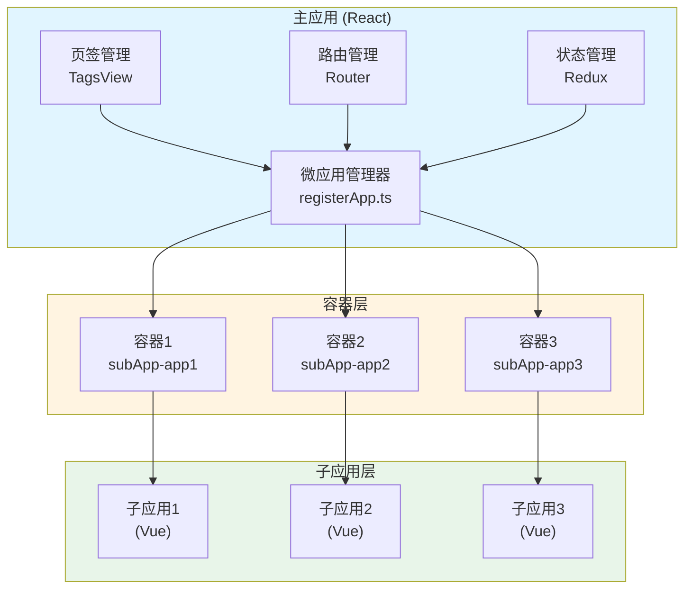
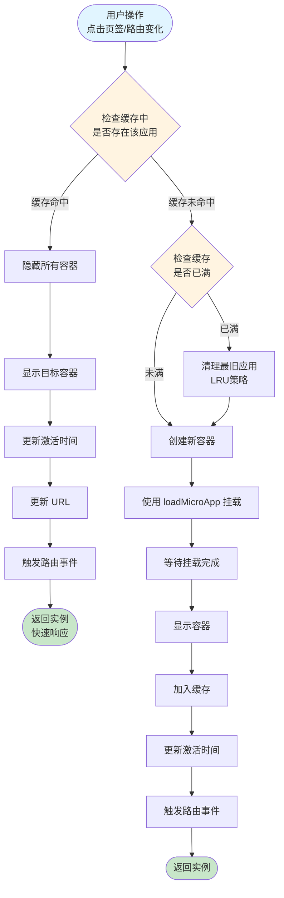
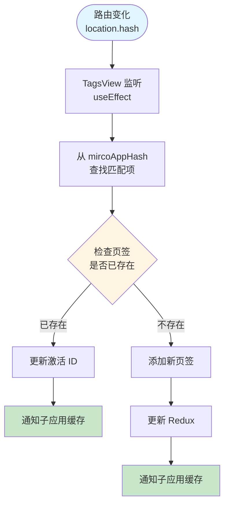
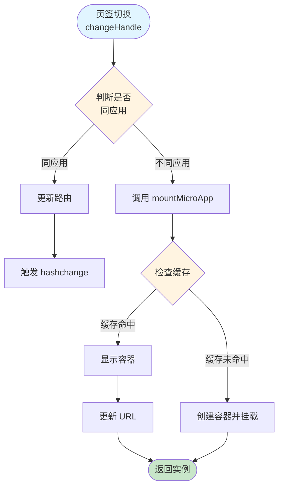

## 📋 目录

*   [项目概述](#项目概述)
*   [实现思路](#实现思路)
*   [Qiankun 配置方案](#qiankun-配置方案)
*   [子应用页签缓存实现](#子应用页签缓存实现)
*   [子应用切换实现](#子应用切换实现)
*   [核心代码解析](#核心代码解析)
*   [使用说明](#使用说明)
*   [注意事项](#注意事项)

***

## 项目概述

基于 **qiankun** 微前端框架实现了一个支持**多页签缓存**和**子应用保活**的主应用系统。主要特性包括：

*   ✅ 手动挂载模式（`loadMicroApp`）
*   ✅ 子应用保活缓存机制
*   ✅ 多页签状态同步
*   ✅ 子应用间快速切换
*   ✅ 页面刷新自动恢复

### 技术栈

*   **主框架**: React + TypeScript
*   **微前端框架**: qiankun
*   **微应用框架**：vue 全家桶
*   **微应用兼容 vite 方案**：vite-plugin-qiankun
*   **主应用状态管理**: Redux Toolkit
*   **主应用路由**: React Router
*   **主应用UI 组件库**: TDesign

***

## 实现思路

### 1. 整体架构设计

本方案采用 **"手动挂载 + 容器保活"** 的架构模式，核心思想是：

*   **主应用**（React）作为容器和调度中心，负责微应用的注册、挂载、卸载和状态管理
*   **子应用**（Vue）作为独立的功能模块，通过 qiankun 生命周期钩子接入
*   **页签系统**作为用户交互层，管理多个子应用页面的打开、切换和关闭
*   **缓存机制**通过 DOM 容器复用实现子应用保活，避免重复挂载带来的性能损耗



### 2. 核心设计理念

#### 2.1 容器隔离策略

**问题**：qiankun 默认的 `singular: true` 模式只允许同时挂载一个子应用，切换时需要卸载旧应用再挂载新应用，导致：

*   应用状态丢失
*   重复加载资源
*   用户体验差

**解决方案**：

*   设置 `singular: false`，允许多实例共存
*   为每个子应用创建独立的 DOM 容器（`subApp-{appName}`）
*   通过 `display: none/block` 控制容器显示/隐藏
*   应用实例保留在内存中，实现真正的"保活"

```typescript
// 关键配置
{
  singular: false,  // 允许多实例
  sandbox: {
    strictStyleIsolation: false,
  }
}

// 容器创建
const containerId = `subApp-${appName}`
container.style.display = 'none'  // 初始隐藏
```

#### 2.2 LRU 缓存淘汰策略

**问题**：无限缓存会导致内存泄漏和性能问题

**解决方案**：

*   维护一个 `Map<string, CachedMicroApp>` 缓存池
*   记录每个应用的 `lastActiveTime`（最后激活时间）
*   当缓存数量超过 `MAX_CACHED_APPS`（默认 5）时，自动清理最旧的非当前应用
*   确保当前激活的应用不会被清理

```typescript
// 缓存结构
type CachedMicroApp = {
  instance: QiankunMicroApp    // qiankun 实例
  containerId: string          // DOM 容器 ID
  lastActiveTime: number       // 最后激活时间（LRU 关键）
  entry: string               // 入口地址
}

// LRU 清理逻辑
const cleanupOldestCachedApp = async () => {
  // 找到最旧的非当前激活应用
  let oldestName = null
  let oldestTime = Infinity
  cachedMicroApps.forEach((cached, name) => {
    if (name !== currentAppName && cached.lastActiveTime < oldestTime) {
      oldestTime = cached.lastActiveTime
      oldestName = name
    }
  })
  if (oldestName) {
    await destroyCachedApp(oldestName)
  }
}
```

#### 2.3 状态同步机制

**问题**：主应用的页签状态需要同步到子应用，让子应用知道哪些页面需要缓存

**解决方案**：

*   使用 qiankun 的 `initGlobalState` 创建全局状态
*   主应用在页签变化时通过 `setGlobalState` 推送状态
*   子应用通过 `onGlobalStateChange` 监听状态变化
*   状态包含 `cachedTags`（需要缓存的页签列表）和 `activeTagId`（当前激活的页签 ID）

```typescript
// 主应用推送
const action = initGlobalState({ 
  cachedTags: ['/page1', '/page2'], 
  activeTagId: 'tag-1' 
})
action.setGlobalState({ cachedTags, activeTagId })

// 子应用监听
props.onGlobalStateChange((state) => {
  const { cachedTags, activeTagId } = state
  // 更新子应用的 keep-alive 缓存
  updateKeepAliveCache(cachedTags)
}, true)
```

### 3. 关键技术实现

#### 3.1 挂载流程设计



#### 3.2 切换优化策略

**同应用内切换**：

*   只需更新路由（`navigate`）
*   触发 `hashchange` 事件
*   子应用内部路由处理
*   **无需重新挂载，性能最优**

**跨应用切换**：

*   检查目标应用是否在缓存中
*   缓存命中：直接显示容器（毫秒级响应）
*   缓存未命中：创建容器并挂载（首次加载）
*   **缓存命中时接近同应用切换的性能**

#### 3.3 卸载策略

**保活模式下的卸载**：

*   不执行真正的 `unmount()`
*   仅隐藏容器（`display: none`）
*   保留应用实例和状态
*   **下次激活时直接显示，无需重新挂载**

**强制卸载场景**：

*   页面刷新
*   用户登出
*   手动清理缓存
*   执行真正的 `unmount()` 和容器销毁

### 4. 数据流设计

#### 4.1 页签状态流



#### 4.2 应用挂载流



### 5. 性能优化考虑

#### 5.1 内存管理

*   **限制缓存数量**：最多 5 个应用，防止内存溢出
*   **LRU 自动清理**：超出限制时自动清理最旧应用
*   **按需卸载**：非保活模式或强制卸载时才真正销毁

#### 5.2 加载优化

*   **缓存命中**：直接显示容器，响应时间 < 10ms
*   **首次加载**：使用 `loadMicroApp` 按需加载，避免预加载所有应用
*   **容器复用**：同一应用多次打开复用同一容器

#### 5.3 状态同步优化

*   **批量更新**：页签变化时批量推送状态，减少通信次数
*   **按需监听**：子应用按需订阅全局状态，避免不必要的更新

### 6. 兼容性设计

#### 6.1 Vite 子应用支持

*   使用 `vite-plugin-qiankun` 插件
*   子应用需要配置正确的 `publicPath`
*   支持开发环境和生产环境的不同配置

#### 6.2 路由兼容

*   主应用使用 React Router
*   子应用使用 Vue Router（hash 模式）
*   通过 `window.location.hash` 和事件触发实现路由同步

#### 6.3 样式隔离

*   当前未启用严格样式隔离（`strictStyleIsolation: false`）
*   建议子应用使用 CSS Modules 或 scoped 样式
*   避免全局样式污染

### 7. 错误处理与容错

#### 7.1 挂载失败处理

*   捕获异常并显示错误提示
*   清理失败的容器和缓存
*   允许用户重试

#### 7.2 容器不存在处理

*   自动创建容器（`ensureContainer`）
*   支持多种父容器选择器降级
*   容器创建失败时抛出明确错误

#### 7.3 页面刷新恢复

*   根据当前 URL 自动识别需要挂载的应用
*   从配置映射表查找匹配的微应用
*   自动恢复挂载状态

***

**总结**：本方案通过容器隔离、LRU 缓存、状态同步等核心机制，实现了高效的微应用页签缓存系统，在保证用户体验的同时有效控制了资源消耗。

## Qiankun 配置方案

### 1. 基础配置

项目采用 **手动挂载模式**（`loadMicroApp`），而非路由自动注册模式（`registerMicroApps`）。这种方式提供了更精细的控制能力，特别适合需要保活缓存的场景。

#### 核心配置参数

```typescript
// src/utils/registerApp.ts

// 沙箱配置
const sandboxConfig = {
  sandbox: {
    strictStyleIsolation: false,        // 不启用严格样式隔离
    experimentalStyleIsolation: false,  // 不启用实验性样式隔离
  },
  singular: false,  // 允许多实例同时存在（保活必需）
}
```

#### 微应用配置类型

```typescript
type MicroAppConfig = {
  name: string          // 微应用名称（唯一标识）
  entry: string        // 微应用入口地址
  container: string    // 容器选择器
  activeRule: string   // 激活规则（路由匹配）
  props: MicroAppProps // 传递给子应用的 props
}
```

### 2. 微应用 Props 配置（我自己的项目是这样的可以根据实际进行更改）

主应用通过 `props` 向子应用传递必要的上下文和方法：

```typescript
type MicroAppProps = {
  token: string | null              // 用户 token
  onLogin: () => void               // 登录回调
  message: typeof MessagePlugin     // 消息提示组件
  notification: typeof NotificationPlugin  // 通知组件
  getUserInfo: () => UserData       // 获取用户信息
  usePermissionList: string[]      // 权限列表
  getBtnCodeList: () => string[]   // 按钮权限列表
  fetchUserInfo: () => void        // 刷新用户信息
  onRefreshPage: (fn: () => void) => void  // 页面刷新回调
  onLogOut: () => void             // 登出回调
  addTagView: (path: string) => void  // 添加页签
  getDefaultPath: () => string | null  // 获取默认路径
}
```

### 3. 容器管理

每个微应用使用独立的 DOM 容器，通过容器显示/隐藏实现保活：

```typescript
// 容器命名规则: subApp-{appName}
const containerId = `subApp-${appName}`

// 容器样式
container.className = 'h-full w-full absolute inset-0'
container.style.display = 'none'  // 初始隐藏
```

***

## 子应用页签缓存实现

### 1. 缓存架构

#### 缓存数据结构

```typescript
type CachedMicroApp = {
  instance: QiankunMicroApp    // qiankun 微应用实例
  containerId: string          // DOM 容器 ID
  lastActiveTime: number       // 最后激活时间（用于 LRU 清理）
  entry: string               // 入口地址
}

// 缓存存储
const cachedMicroApps: Map<string, CachedMicroApp> = new Map()
```

#### 缓存配置

```typescript
// 是否启用保活模式（默认启用）
let keepAliveEnabled = true

// 最大缓存数量（超过时清理最旧的应用）
const MAX_CACHED_APPS = 5
```

### 2. 缓存生命周期

#### 2.1 首次挂载（缓存创建）

```typescript
// 1. 检查缓存是否已满，清理最旧的应用
await cleanupOldestCachedApp()

// 2. 隐藏所有已缓存的应用容器
hideAllCachedContainers()

// 3. 为新应用创建独立容器
const appContainerId = createAppContainer(name, mainContainerId)

// 4. 使用 loadMicroApp 挂载
const microApp = loadMicroApp({
  name,
  entry,
  container: `#${appContainerId}`,
  props: mergedProps,
}, sandboxConfig)

// 5. 等待挂载完成
await microApp.mountPromise

// 6. 显示容器并加入缓存
showAppContainer(appContainerId)
cachedMicroApps.set(name, {
  instance: microApp,
  containerId: appContainerId,
  lastActiveTime: Date.now(),
  entry,
})
```

#### 2.2 从缓存激活

```typescript
// 1. 检查缓存中是否存在
const cached = cachedMicroApps.get(name)

if (cached) {
  // 2. 隐藏所有其他应用的容器
  hideAllCachedContainers()
  
  // 3. 显示目标应用的容器
  showAppContainer(cached.containerId)
  
  // 4. 更新激活时间
  cached.lastActiveTime = Date.now()
  
  // 5. 更新当前应用信息
  currentAppName = name
  currentMicroApp = cached.instance
  
  // 6. 更新 URL 并触发路由事件
  if (path) {
    window.history.pushState(null, '', path)
    window.dispatchEvent(new HashChangeEvent('hashchange'))
    window.dispatchEvent(new PopStateEvent('popstate'))
  }
  
  return cached.instance  // 直接返回，无需重新挂载
}
```

#### 2.3 缓存清理（LRU 策略）

当缓存数量超过 `MAX_CACHED_APPS` 时，清理最旧的非当前激活应用：

```typescript
const cleanupOldestCachedApp = async () => {
  if (cachedMicroApps.size < MAX_CACHED_APPS) {
    return
  }

  // 找到最旧的非当前激活的应用
  let oldestName: string | null = null
  let oldestTime = Infinity

  cachedMicroApps.forEach((cached, name) => {
    if (name !== currentAppName && cached.lastActiveTime < oldestTime) {
      oldestTime = cached.lastActiveTime
      oldestName = name
    }
  })

  if (oldestName) {
    await destroyCachedApp(oldestName)
  }
}
```

### 3. 页签状态同步

主应用通过 **qiankun 全局状态**（`initGlobalState`）向子应用同步页签缓存信息：

```typescript
// src/layout/TagsView/index.tsx

// 通知子应用缓存的公共方法
const notifySubAppCache = (tagsList: typeof tagsViewList, triggerSource: string) => {
  const stateTags = tagsList.map((item) => {
    if (item.path) {
      return (item.path as string).split('/').pop()
    }
    return '*'
  })
  
  // 使用 qiankun 全局状态同步
  const action: MicroAppStateActions = initGlobalState({ cachedTags: stateTags })
  action.setGlobalState({ cachedTags: stateTags })
}
```

**触发时机**：

*   新增页签时
*   切换页签时
*   删除页签时
*   页签已存在时（确保状态同步）

**子应用接收**（子应用需要实现）：

```typescript
// 子应用代码示例
export async function mount(props) {
  // 监听全局状态变化
  props.onGlobalStateChange((state, prev) => {
    const { cachedTags } = state
    // 根据 cachedTags 更新子应用的 keep-alive 缓存
    updateKeepAliveCache(cachedTags)
  }, true)  // fireImmediately = true，立即触发一次
}
```

***

## 子应用切换实现

### 1. 切换流程

#### 1.1 同应用内页面切换

当切换的页签属于同一个微应用时，只需更新路由，无需重新挂载：

```typescript
// src/layout/TagsView/index.tsx

const changeHandle = async (value: TabValue) => {
  const findItem = tagsViewList.find((item) => item.id == value)
  const currentApp = getCurrentAppName()
  
  // 判断是否是同一个微应用内的页面切换
  if (currentApp === findItem.mircoAppName) {
    // 同一个微应用内切换，只需更新路由
    navigate(`${findItem.activeRule}/#${findItem.path}`)
    window.dispatchEvent(new Event('hashchange'))
  }
}
```

#### 1.2 不同应用间切换

当切换到不同的微应用时，触发挂载流程：

```typescript
else if (findItem.mircoAppName && findItem.entry) {
  // 不同微应用之间切换，需要挂载新应用
  initMicroApps(mircoAppList)
  await mountMicroApp({
    name: findItem.mircoAppName as string,
    entry: findItem.entry as string,
    path: fullPath,
  })
}
```

**切换逻辑**：

1.  如果目标应用已在缓存中 → 直接激活（显示容器）
2.  如果目标应用不在缓存中 → 创建新容器并挂载
3.  如果缓存已满 → 清理最旧的应用后再挂载

### 2. 卸载逻辑

#### 2.1 保活模式下的卸载

在保活模式下，卸载操作实际上只是隐藏容器，不真正销毁应用：

```typescript
export const unmountMicroApp = async (force = false): Promise<void> => {
  // 保活模式下，只隐藏容器，不真正卸载
  if (keepAliveEnabled && !force) {
    const cached = cachedMicroApps.get(currentAppName)
    if (cached) {
      hideAppContainer(cached.containerId)  // 仅隐藏
      currentMicroApp = null
      currentAppName = null
      return  // 不执行真正的卸载
    }
  }
  
  // 非保活模式或强制卸载，执行真正的卸载
  // ...
}
```

#### 2.2 强制卸载

某些场景需要真正销毁应用（如刷新、登出）：

```typescript
// 强制卸载指定应用
export const removeCachedApp = async (appName: string): Promise<void> => {
  if (cachedMicroApps.has(appName)) {
    await destroyCachedApp(appName)  // 真正销毁
  }
}

// 清空所有缓存
export const clearAllCachedApps = async (): Promise<void> => {
  const appNames = Array.from(cachedMicroApps.keys())
  for (const appName of appNames) {
    await destroyCachedApp(appName)
  }
}
```

### 3. 页面刷新恢复

页面刷新后，根据当前路由自动恢复微应用挂载：

```typescript
// src/views/microApp/index.tsx

useEffect(() => {
  if (mircoAppList && mircoAppList.length > 0 && !mountedRef.current) {
    // 初始化微应用配置
    initMicroApps(mircoAppList)
    
    // 根据当前路由挂载微应用
    const timer = setTimeout(async () => {
      const mounted = await remountByCurrentRoute()
      if (mounted) {
        mountedRef.current = true
      }
    }, 100)
    
    return () => clearTimeout(timer)
  }
}, [mircoAppList])
```

```typescript
// src/utils/registerApp.ts

export const remountByCurrentRoute = async (): Promise<boolean> => {
  const currentPathname = window.location.pathname
  const currentHash = window.location.hash
  const fullPath = currentPathname + currentHash
  
  // 查找匹配当前路由的微应用配置
  const matchedConfig = findMicroAppByPath(currentPathname)
  
  if (!matchedConfig) {
    return false
  }
  
  // 挂载微应用
  const app = await mountMicroApp({
    name: matchedConfig.name,
    entry: matchedConfig.entry,
    container: matchedConfig.container,
    path: fullPath,
  })
  
  return app !== null
}
```

***

## 核心代码解析

### 1. 微应用初始化

```typescript
// src/utils/registerApp.ts

export const initMicroApps = (appData: any[], permissionList = ['*']) => {
  if (!appData || !appData.length) {
    console.warn('没有可用的微应用数据')
    return
  }

  globalPermissionList = permissionList

  // 转换应用数据并缓存配置
  const flatData = flattenData(appData)
  const configs = transformData(flatData, permissionList)

  // 存储到配置映射表
  configs.forEach((config) => {
    microAppConfigMap.set(config.name, config)
  })

  console.log('微应用配置已初始化:', Array.from(microAppConfigMap.keys()))
}
```

### 2. 挂载核心逻辑

```typescript
export const mountMicroApp = async (params: MountMicroAppParams): Promise<QiankunMicroApp | null> => {
  const { name, entry, container = '#subApp', path, defaultPath, props: extraProps } = params
  
  try {
    loader(true)
    
    // 确保容器存在
    const mainContainerId = getContainerId(container)
    const containerReady = await waitForContainer(mainContainerId)
    if (!containerReady) {
      throw new Error(`容器 #${mainContainerId} 不存在或无法创建`)
    }

    // ==================== 保活模式逻辑 ====================
    if (keepAliveEnabled) {
      // 检查缓存
      const cached = cachedMicroApps.get(name)
      
      if (cached) {
        // 从缓存激活
        hideAllCachedContainers()
        showAppContainer(cached.containerId)
        cached.lastActiveTime = Date.now()
        currentAppName = name
        currentMicroApp = cached.instance
        
        if (path) {
          window.history.pushState(null, '', path)
          window.dispatchEvent(new HashChangeEvent('hashchange'))
        }
        
        loader(false)
        return cached.instance
      }
      
      // 新建并缓存
      await cleanupOldestCachedApp()
      hideAllCachedContainers()
      const appContainerId = createAppContainer(name, mainContainerId)
      
      const microApp = loadMicroApp({
        name,
        entry,
        container: `#${appContainerId}`,
        props: mergedProps,
      }, sandboxConfig)
      
      await microApp.mountPromise
      showAppContainer(appContainerId)
      
      cachedMicroApps.set(name, {
        instance: microApp,
        containerId: appContainerId,
        lastActiveTime: Date.now(),
        entry,
      })
      
      currentAppName = name
      currentMicroApp = microApp
      
      loader(false)
      return microApp
    }
    
    // ==================== 非保活模式 ====================
    // ... 传统卸载后挂载逻辑
  } catch (error) {
    console.error(`挂载微应用 ${name} 失败:`, error)
    loader(false)
    return null
  }
}
```

### 3. 页签管理

```typescript
// src/layout/TagsView/index.tsx

// 监听路由变化，自动添加页签
useEffect(() => {
  const hashPath = extractPath(location.hash)
  
  if (mircoAppHash[hashPath]) {
    const matchedItem = mircoAppHash[hashPath]
    const index = tagsViewList.findIndex((tag) => tag?.id == matchedItem?.id)
    
    if (~index) {
      // 页签已存在，只更新激活状态
      dispatch(setActionTagsViewId(matchedItem.id))
      notifySubAppCache(tagsViewList, `页签已存在 ${hashPath}`)
      return
    }
    
    // 新增页签
    const _tagsViewList = cloneDeep(tagsViewList) ?? []
    _tagsViewList.push(matchedItem)
    dispatch(setTagsViewList(_tagsViewList))
    dispatch(setActionTagsViewId(matchedItem.id))
    
    // 通知子应用缓存更新
    notifySubAppCache(_tagsViewList, `新页签打开 ${hashPath}`)
  }
}, [location.hash])
```

***

## 使用说明

### 1. 初始化微应用

```typescript
import { initMicroApps } from '@/utils/registerApp'

// 在应用启动时初始化
useEffect(() => {
  if (mircoAppList && mircoAppList.length > 0) {
    initMicroApps(mircoAppList, permissionList)
  }
}, [mircoAppList])
```

### 2. 挂载微应用

```typescript
import { mountMicroApp } from '@/utils/registerApp'

// 手动挂载
await mountMicroApp({
  name: 'app-name',
  entry: 'https://app.example.com',
  container: '#subApp',
  path: '/wly-base/app-name/#/home',
  defaultPath: '/home',  // 子应用默认路径
})
```

### 3. 控制保活模式

```typescript
import { setKeepAliveEnabled, isKeepAliveEnabled } from '@/utils/registerApp'

// 启用/禁用保活
setKeepAliveEnabled(true)

// 查询状态
const enabled = isKeepAliveEnabled()
```

### 4. 清理缓存

```typescript
import { clearAllCachedApps, removeCachedApp } from '@/utils/registerApp'

// 清空所有缓存
await clearAllCachedApps()

// 移除指定应用
await removeCachedApp('app-name')
```

### 5. 子应用接入

子应用需要：

1.  **导出生命周期钩子**：

```typescript
// 子应用入口文件
export async function bootstrap() {
  console.log('子应用启动')
}

export async function mount(props) {
  // 监听全局状态
  props.onGlobalStateChange((state) => {
    const { cachedTags } = state
    // 更新 keep-alive 缓存
  }, true)
  
  // 渲染应用
  render(props)
}

export async function unmount() {
  // 清理
}
```

2.  **配置 webpack publicPath**：

```javascript
// webpack.config.js
module.exports = {
  output: {
    publicPath: process.env.NODE_ENV === 'production' 
      ? 'https://app.example.com/' 
      : '//localhost:3000/',
  },
}
```

***

## 注意事项

### 1. 容器管理

*   ✅ 每个微应用使用独立容器（`subApp-{appName}`）
*   ✅ 容器使用绝对定位，避免布局冲突
*   ✅ 切换时通过 `display: none/block` 控制显示

### 2. 内存管理

*   ⚠️ 缓存数量限制为 5 个（`MAX_CACHED_APPS`）
*   ⚠️ 超过限制时自动清理最旧的应用
*   ⚠️ 页面刷新会清空所有缓存

### 3. 路由同步

*   ✅ 使用 `window.history.pushState` 更新 URL
*   ✅ 手动触发 `hashchange` 和 `popstate` 事件
*   ✅ 子应用需要监听路由变化

### 4. 状态同步

*   ✅ 使用 qiankun `initGlobalState` 同步页签状态
*   ✅ 子应用需要实现 `onGlobalStateChange` 监听
*   ✅ 页签变化时及时通知子应用

### 5. 样式隔离

*   ⚠️ 当前未启用严格样式隔离
*   ⚠️ 建议使用 CSS Modules 或 styled-components
*   ⚠️ 避免全局样式污染

### 6. 性能优化

*   ✅ 保活模式减少重复挂载开销
*   ✅ LRU 缓存策略控制内存使用
*   ✅ 容器显示/隐藏比卸载/挂载更快
